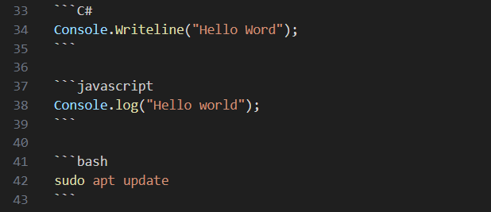

#Familiarization Document

First off -- we start with familiarizing with markdown language.

Using VS Code as my code editor, I used the `Markdown Preview Enhanced` extension to start off and preview my document.

#Testing out lists

Testing out the list functionality as follows:
* First item
* Second item
* Third item

Numbered lists can be displayed as follows:
1. First Numbered item
2. Second Numbered item
3. Third Numbered item

#Testing out different emphasise    

*This text* is italic.
**This text** is bold.
~~This text~~ is striked through.

You can also have text that are ***bold and italics***.

Lastly, we have task lists:
* [ ] First Task
* [ ] Second Task
* [x] Third Task (which is checked)

# Checking out Code Snippets

So we can have `code snippets`.

We can also have blocks of code:

```C#
Console.Writeline("Hello Word");
```

```javascript
Console.log("Hello world");
```

```bash
sudo apt update
```

#Images and Hyperlinks

Code snippets in markdown can recgonize the language when specified, and it also shows the synax:


Noticed -- I just added an image above too.

We can also add hyperlinks as follows:
[Pet Coach Website!](https://petcoach.sg/ "Pet Coach Main Website")[^1]

[^1]: This is the footnote to specify the Pet Coach Website Details

# Line Breaks and Tables

First lorem ipsum paragraph here, followed by some line breaks for orgnization purposes.

___

Next lorem ipsum paragraph. Refer to the table below:

| Header 1 | Header 2 |
|----------|----------|
| Content 1| Content 2|

# Next Steps

The next steps would comprise of trying to host this exact site in our Github repository. We can simply use the base template -- Minima.

We will check with `ChatGTP`, on how we can proceed to host this on Github pages.